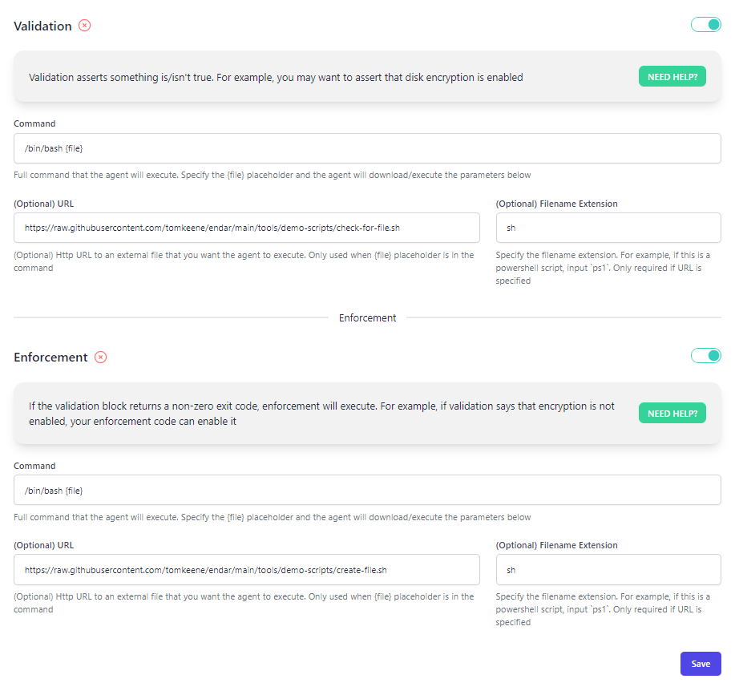
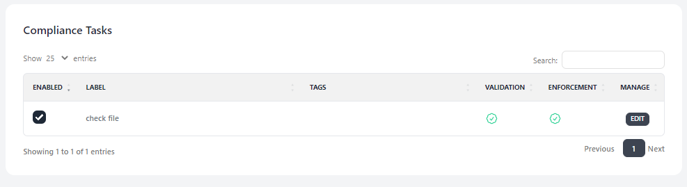
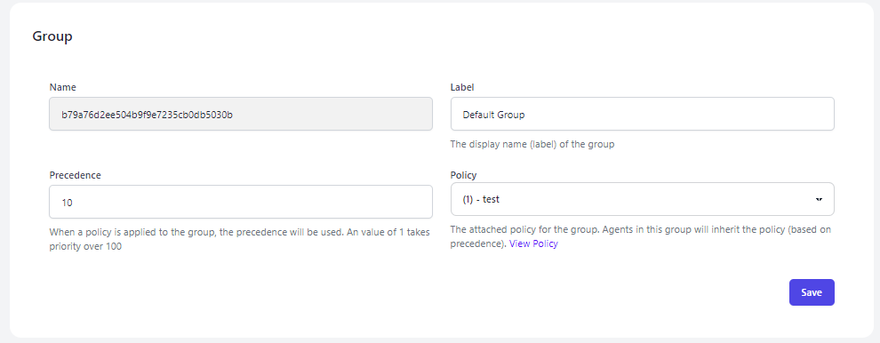

# Endar

### Table of Contents
1. [About](#about)
2. [Main Features](#main-features)
3. [Getting Started](#getting-started)
4. [Creating your first policy](#creating-your-first-policy)
5. [Roadmap](#roadmap)

### About
Endar is an RMM (Remote monitoring and management) tool that supports Windows, Linux and MacOS. The Endar agent is a binary that runs on the endpoints and communicates with the Endar server. *Endar is currently in Alpha mode - while it works great, the server architecture does not support 100's of agents.*

Home Dashboard          |
:-------------------------:|
  |

### Main Features
Endar has two main features that are simple; Compliance Management & Monitoring. This tool was originially created to meet compliance requirements.

##### Compliance Management
Compliance management allows you to ask if something is true (assertion) and then optionally perform remediation. In practice, Endar uses scripts/programs to achieve this. For example, lets pretend you want to ensure the Windows firewall is enabled (a common compliance task). You would create a "validation" script to check if the firewall is enabled. If the firewall is _not_ enabled, your "enforcement" script would then execute, bringing the asset back into compliance. Endar is not opinionated so you can write scripts in whatever language you please (powershell, bash, python, etc).

Compliance Management          |  
:-------------------------:|
  |

##### Monitoring
Monitoring consists of the Endar agents collecting host-based metrics and periodically forwarding the data to the Endar server. Metrics consist of disk performance, memory stats, disk stats, load performance and more.

Monitoring Agents          |  
:-------------------------:|
  |

### Getting Started

##### Setting up the server with Docker

The following instructions are to get you started very quickly. This is not for a production deployment. Outside of a lab, it is `highly` recommended to use a load balancer (with TLS) in front of the Endar server and forward the traffic.

```
$ git clone https://github.com/tomkeene/endar.git; cd endar
$ docker build --tag endar_server .
$ export SETUP_DB=yes;docker-compose up -d
```

The server should be running on `http://<your-ip>:5000`  
The default email/password is `admin@example.com:admin`

##### Setting up the agents
The agents (Windows, Linux, MacOS) connect to the server. Before you deploy the agents, you need the registration token and the server address. The registration token can be found in the Endar server at this URL `http://<your-ip>:5000/settings`

###### Deploy Windows agent
```
```

###### Deploy Linux agent
```
./endar.exe --key <registration-token> --server http://<your-ip>:5000
```

###### Deploy MacOS agent
```
./endar.exe --key <registration-token> --server http://<your-ip>:5000
```

### Creating your first policy
We are going to create a policy and attach a very simple compliance task. In this task, we are going to check if a file exists and if it does not, we will create it. It will run every 300 seconds (5 minutes) and enforce the compliance. This compliance task will be a bash script so make sure you have a linux agent ready to go. 

1.) In the Endar server, go to `Compliance` and select "New".  
2.) View the image below as a reference but we will need to fill in the Validation and Enforcement sections  
3.) Under Validation, the command will be `/bin/bash {file}`, the URL will be `https://raw.githubusercontent.com/tomkeene/endar/main/tools/demo-scripts/check-for-file.sh` and the filename extension is `sh`  
4.) Under Enforcement, the command will also be `/bin/bash {file}`, the URL will be `https://raw.githubusercontent.com/tomkeene/endar/main/tools/demo-scripts/create-file.sh` and the filename extension is `sh`  
5.) Select `Save` and also make sure the button toggles are enabled  

Create the compliance task          |
:-------------------------:|
  |

Next, we are going to add the compliance task to a policy.  

1.) Select `Policies` and `New` (give it a name)  
2.) Edit the policy and select the check box of the compliance task to enable it (see figure below)  

Add the compliance task to the policy          |
:-------------------------:|
  |

Lastly, we are going to add our policy to the default group.  

1.) Head over to `Groups` and `View` the default group  
2.) In the dropdown, select the policy you created and click `Save`. See figure below

Add policy to the default group          |
:-------------------------:|
  |

All done! Now your agent will execute this compliance task and send the results. You can view the results by going to `Agents`, selecting your agent, and then clicking the `Compliance` tab on the left.

### Roadmap
- [ ] Improve monitoring to gather software, services, scheduled tasks (cronjobs), users and groups
- [ ] Improve monitoring to collect process specific metrics
- [ ] Improve deployment - currently a binary is provided by OS specific installers would be nice
- [ ] Improve architecture - the current deployment architecture will not support hundreds of agents. Its probably easiest to just leverage managed solutions of a popular provider such as GCP.  
- [ ] - Add other "RMM" features (one-click install of apps, etc)
