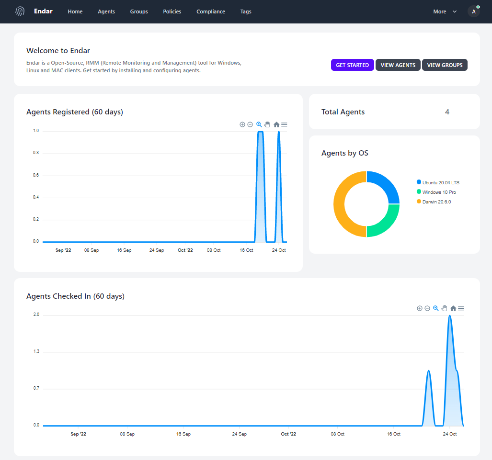
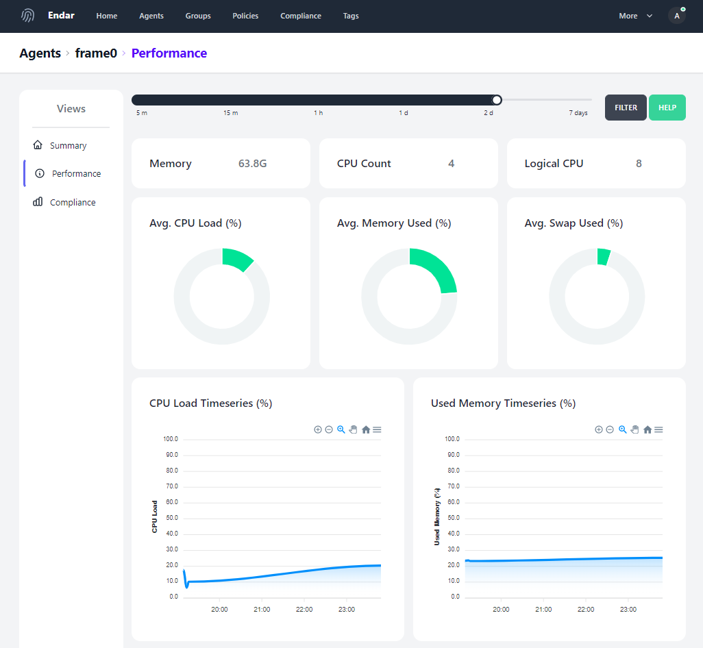

# Endar

### About
Endar is an RMM (Remote monitoring and management) tool that supports Windows, Linux and MacOS. The Endar agent is a binary that runs on the endpoints and communicates with the Endar server. *Endar is currently in Alpha mode - while it works great, the server architecture does not support 100's of agents.*

Home Dashboard          |
:-------------------------:|
  |

### Main Features
Endar has two main features that are simple; Compliance Management & Monitoring. This tool was originially created to meet compliance requirements.

##### Compliance Management
Compliance management allows you to ask if something is true (assertion) and then optionally perform remediation. In practice, Endar uses scripts/programs to achieve this. For example, lets pretend you want to ensure the Windows firewall is enabled (a common compliance task). You would create a "validation" script to check if the firewall is enabled. If the firewall is _not_ enabled, your "enforcement" script would then execute, bringing the asset back into compliance. Endar is not opinionated so you can write scripts in whatever language you please (powershell, bash, python, etc).

Compliance Management          |  
:-------------------------:|
  |

##### Monitoring
Monitoring consists of the Endar agents collecting host-based metrics and periodically forwarding the data to the Endar server. Metrics consist of disk performance, memory stats, disk stats, load performance and more.

Monitoring Agents          |  
:-------------------------:|
  |

### Getting Started

### Roadmap
- [ ] Improve monitoring to gather software, services, scheduled tasks (cronjobs), users and groups
- [ ] Improve monitoring to collect process specific metrics
- [ ] Improve deployment - currently a binary is provided by OS specific installers would be nice
- [ ] Improve architecture - the current deployment architecture will not support hundreds of agents. Its probably easiest to just leverage managed solutions of a popular provider such as GCP.
